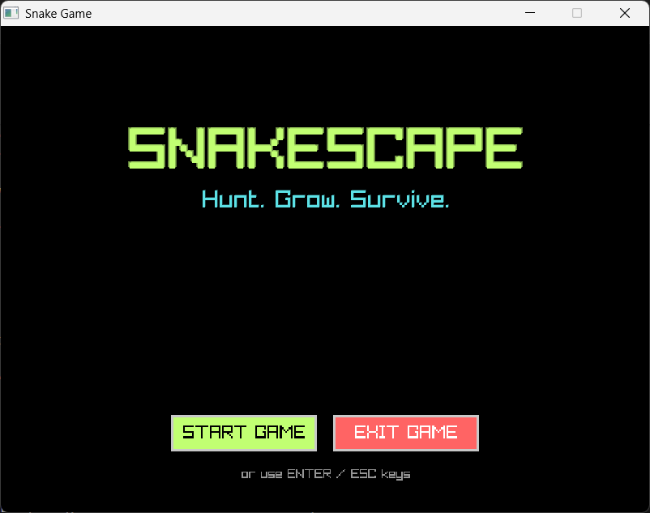
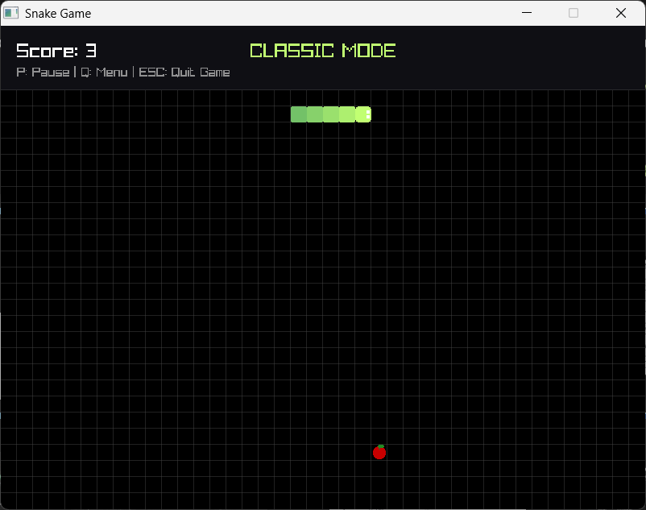
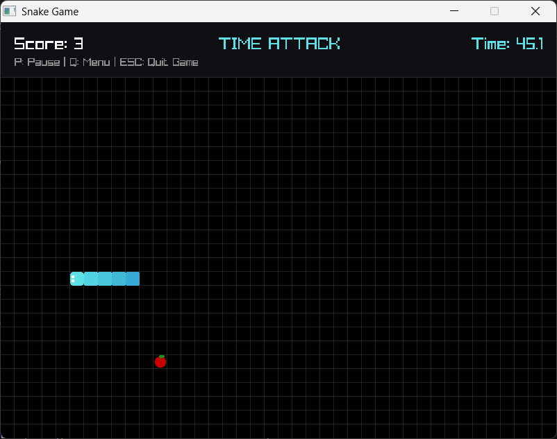
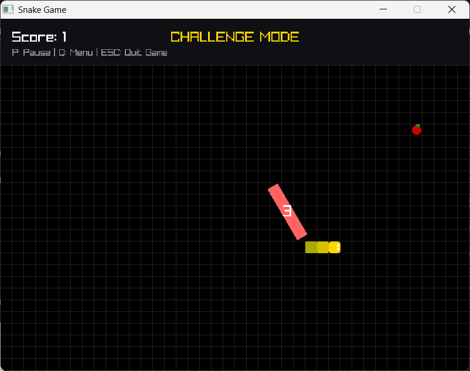
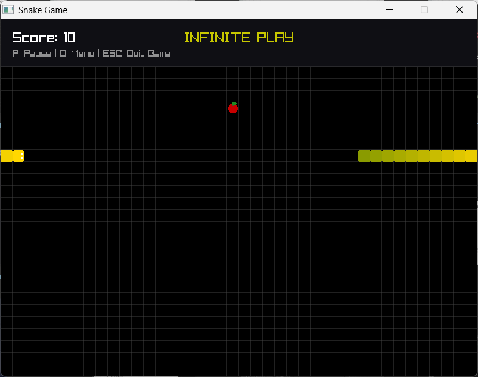

# SNAKESCAPE

**Hunt. Grow. Survive.**

A modern twist on the classic Snake game with multiple game modes, stunning visuals, and challenging gameplay mechanics built with C and Raylib.


## Screenshots

### Front Page


### Main Menu


### Classic Mode


### Time Attack


### Challenge Mode


### Infinite Play


## Features

- **4 Unique Game Modes**
  * **Classic Mode**: Traditional snake gameplay with progressive difficulty
  * **Time Attack**: Race against the clock to achieve the highest score
  * **Challenge Mode**: Dodge phantom walls and collect golden fruits
  * **Infinite Play**: Relaxed mode where the snake can't die

- **Modern UI Design**
  * Vibrant color scheme with glow effects
  * Smooth animations and transitions
  * Intuitive menu system with mouse and keyboard support

- **Polished Gameplay**
  * Responsive controls with WASD and arrow key support
  * Dynamic difficulty scaling
  * Visual feedback and countdown timers
  * Pause functionality

## Prerequisites

- C Compiler (GCC, Clang, or MSVC)
- [Raylib](https://www.raylib.com/) library (version 4.0 or higher)

## Installation

### Linux / macOS

1. Install Raylib:
```bash
# Ubuntu/Debian
sudo apt install libraylib-dev

# macOS (using Homebrew)
brew install raylib
```

2. Clone the repository:
```bash
git clone https://github.com/subhiksha1196/snakescape.git
cd snakescape
```

3. Compile the game:
```bash
gcc snake_game.c -o snakescape -lraylib -lm
```

4. Run the game:
```bash
./snakescape
```

### Windows

1. Download and install Raylib from [raylib.com](https://www.raylib.com/)

2. Clone the repository:
```bash
git clone https://github.com/subhiksha1196/snakescape.git
cd snakescape
```

3. Compile using your preferred method:
   - **MinGW/w64devkit**: 
   ```bash
   gcc snake_game.c -o snakescape.exe -I<path-to-raylib>/include -L<path-to-raylib>/lib -lraylib -lopengl32 -lgdi32 -lwinmm
   ```
   - **MSVC**: Use Visual Studio with Raylib configured

4. Run the executable:
```bash
.\snakescape.exe
```

## Controls

### Menu Navigation
- **Arrow Keys / W,S**: Navigate menu options
- **Enter / Space / Mouse Click**: Select option
- **ESC**: Quit game

### In-Game
- **Arrow Keys / WASD**: Control snake direction
- **P**: Pause/Resume game
- **Q**: Return to menu
- **ESC**: Quit game completely

## Game Modes

### Classic Mode
The traditional snake experience. Eat apples to grow longer and increase your score. The game ends when you hit a wall or collide with yourself. Speed gradually increases as you grow.

### Time Attack Mode
You have 60 seconds to score as many points as possible. The game moves faster than Classic mode, making it more challenging. Race against time and see how long you can make your snake!

### Challenge Mode
The ultimate test of skill. In addition to regular gameplay:
- **Phantom Walls**: Temporary red walls appear every 5 seconds that last for 3 seconds
- **Golden Fruits**: Special orange fruits worth 3 points (appear randomly)
- Faster speed increases for higher difficulty

### Infinite Play
A relaxed mode for endless fun:
- Snake wraps around screen edges instead of dying
- No self-collision until length reaches 20
- Perfect for practicing or casual play

## Scoring

- Each regular apple: **+1 point**
- Each golden fruit (Challenge mode): **+3 points**
- Final score = Snake length - 2

## Technical Details

- **Language**: C
- **Graphics Library**: Raylib
- **Screen Resolution**: 800x600
- **Grid Size**: 20x20 pixels
- **Target FPS**: 60

## Project Structure

```
snakescape/
├── snake_game.c           # Main game source code
├── screenshots/           # Game screenshots
└── README.md              # This file
```

## Known Issues

- None at the moment. Please report any bugs in the Issues section.

## Future Enhancements

- High score tracking and leaderboard
- Sound effects and background music
- Additional game modes
- Customizable color themes
- Power-ups and special items
- Multiplayer support

## Acknowledgments

- Built with [Raylib](https://www.raylib.com/) - A simple and easy-to-use library to enjoy videogames programming
- Inspired by the classic Nokia Snake game

## Authors

- Subhiksha - [GitHub](https://github.com/subhiksha1196)
- Sreya - [GitHub](https://github.com/sreya889)
- Sanjai - [GitHub](https://github.com/Sanjai05122006)

## Support

If you enjoy this game, please consider:
- Starring the repository ⭐
- Sharing it with friends
- Contributing to the project
- Reporting bugs and suggesting features

---

**Made with passion for classic gaming** 🎮 | Version 1.0